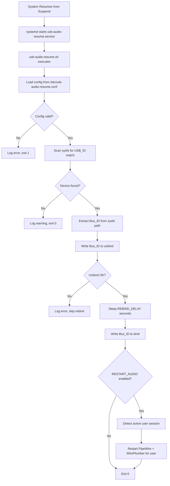

# Design Document: USB Audio Resume Hook

## Overview

This feature implements a systemd suspend/resume hook that automatically performs a USB unbind/rebind cycle on configured USB audio devices after the system wakes from suspend. This solves the common problem on CachyOS (and other Arch-based distributions) where external USB audio cards fail to re-enumerate after resume, requiring a physical replug.

The solution consists of three deliverables:
1. A POSIX-compatible shell script (`usb-audio-resume.sh`) that performs device detection, unbind/rebind, and optional audio daemon restart
2. A systemd service unit (`usb-audio-resume.service`) that triggers the script on resume
3. A configuration file (`/etc/usb-audio-resume.conf`) for user-customizable settings

The script runs as root via systemd, reads a simple key=value config file, scans sysfs to locate the target USB device by vendor:product ID, performs the unbind/rebind cycle with a configurable delay, and optionally restarts PipeWire/WirePlumber for the active user session.

## Architecture

The system follows a linear execution model triggered by systemd's suspend/resume lifecycle:



### Key Design Decisions

1. **systemd service (not system-sleep hook)**: Using a `usb-audio-resume.service` with `After=suspend.target` rather than a `/usr/lib/systemd/system-sleep/` hook script. The service approach provides better logging integration, dependency ordering, and is the modern recommended pattern. The system-sleep hook approach requires the script to check `$1 == "post"` and runs in a less controlled environment.

2. **sysfs scanning over hardcoded paths**: Bus IDs like `1-2` or `3-1.4` can change between boots or when USB topology changes. Scanning `/sys/bus/usb/devices/*/idVendor` and `idProduct` dynamically resolves the correct bus ID every time.

3. **POSIX shell (#!/bin/sh)**: No bashisms needed. POSIX sh is lighter and available everywhere. The script uses only standard utilities (`cat`, `sleep`, `echo`, `logger`).

4. **User session detection for audio restart**: PipeWire/WirePlumber run as user services. The script must identify the active user (via `loginctl`) and use `systemctl --user --machine=<user>@.host` to restart services as that user from a root context.

## Components and Interfaces

### Component 1: Configuration Loader

**File**: Embedded in `usb-audio-resume.sh`

**Responsibility**: Read and validate `/etc/usb-audio-resume.conf`

**Interface**:
- Input: Config file path (`/etc/usb-audio-resume.conf`)
- Output: Shell variables `USB_ID`, `REBIND_DELAY`, `RESTART_AUDIO`
- Error: Exits with status 1 if config file missing or `USB_ID` unset

**Config file format** (shell-sourceable key=value):
```ini
# /etc/usb-audio-resume.conf
# Vendor:Product ID of the USB audio device (required)
USB_ID="1234:5678"

# Delay in seconds between unbind and rebind (default: 1)
REBIND_DELAY=1

# Restart PipeWire/WirePlumber after rebind (default: false)
RESTART_AUDIO=false
```

The config file is sourced directly (`. /etc/usb-audio-resume.conf`), so it must contain valid shell variable assignments. Defaults are set before sourcing so that only `USB_ID` is strictly required.

### Component 2: Device Scanner

**File**: Embedded in `usb-audio-resume.sh`

**Responsibility**: Locate USB devices matching the configured vendor:product ID

**Interface**:
- Input: `USB_ID` variable (format: `VVVV:PPPP`)
- Output: One or more Bus_IDs (e.g., `1-2`, `3-1.4`)
- Behavior: Iterates `/sys/bus/usb/devices/*/`, reads `idVendor` and `idProduct` files, compares against the configured ID

**Algorithm**:
```
Split USB_ID on ":" into VENDOR and PRODUCT
For each directory in /sys/bus/usb/devices/*/:
    Read idVendor file, trim whitespace
    Read idProduct file, trim whitespace
    If idVendor == VENDOR and idProduct == PRODUCT:
        Extract directory basename as Bus_ID
        Add to matched list
```

### Component 3: Unbind/Rebind Engine

**File**: Embedded in `usb-audio-resume.sh`

**Responsibility**: Perform the USB soft-replug for each matched device

**Interface**:
- Input: List of Bus_IDs, `REBIND_DELAY` value
- Output: Success/failure logged per device
- Sysfs paths:
  - Unbind: `/sys/bus/usb/drivers/usb/unbind`
  - Bind: `/sys/bus/usb/drivers/usb/bind`

### Component 4: Audio Daemon Restarter

**File**: Embedded in `usb-audio-resume.sh`

**Responsibility**: Restart PipeWire and WirePlumber for the active user session

**Interface**:
- Input: `RESTART_AUDIO` flag
- Output: Restart commands issued, results logged
- Method: Detect active graphical user via `loginctl list-users --no-legend`, then run `systemctl --user --machine=<user>@.host restart pipewire wireplumber`

### Component 5: Systemd Service Unit

**File**: `usb-audio-resume.service`

**Responsibility**: Trigger the hook script on system resume

**Unit configuration**:
```ini
[Unit]
Description=USB Audio Device Rebind on Resume
After=suspend.target hibernate.target hybrid-sleep.target suspend-then-hibernate.target

[Service]
Type=oneshot
ExecStart=/usr/local/bin/usb-audio-resume.sh

[Install]
WantedBy=suspend.target hibernate.target hybrid-sleep.target suspend-then-hibernate.target
```

### Component 6: Installer Script

**File**: `install.sh` / `uninstall.sh` (or combined with flags)

**Responsibility**: Copy files to system paths, enable/disable the service

**Install paths**:
| File | Destination |
|------|-------------|
| `usb-audio-resume.sh` | `/usr/local/bin/usb-audio-resume.sh` |
| `usb-audio-resume.service` | `/etc/systemd/system/usb-audio-resume.service` |
| `usb-audio-resume.conf` | `/etc/usb-audio-resume.conf` (no overwrite if exists) |

## Data Models

### Configuration File Schema

| Variable | Type | Required | Default | Description |
|----------|------|----------|---------|-------------|
| `USB_ID` | String (`XXXX:XXXX`) | Yes | — | Vendor:Product hex ID pair |
| `REBIND_DELAY` | Integer (seconds) | No | `1` | Delay between unbind and rebind |
| `RESTART_AUDIO` | Boolean (`true`/`false`) | No | `false` | Whether to restart PipeWire/WirePlumber |

### Sysfs Device Structure

For a USB device at bus ID `1-2`:
```
/sys/bus/usb/devices/1-2/
├── idVendor      # e.g., "1234"
├── idProduct     # e.g., "5678"
├── manufacturer  # e.g., "FooBar Audio"
└── product       # e.g., "USB DAC"
```

### Log Message Format

All log messages use `logger` with tag `usb-audio-resume`:
```
logger -t usb-audio-resume "message"
```

Severity levels:
- Informational: `logger -t usb-audio-resume "Unbound device 1-2"`
- Warning: `logger -t usb-audio-resume -p user.warning "No device found for 1234:5678"`
- Error: `logger -t usb-audio-resume -p user.err "Failed to unbind 1-2: ..."`


## Correctness Properties

*A property is a characteristic or behavior that should hold true across all valid executions of a system — essentially, a formal statement about what the system should do. Properties serve as the bridge between human-readable specifications and machine-verifiable correctness guarantees.*

Most of this feature is side-effect-heavy (writing to sysfs, restarting services, logging). Only the device scanning/matching logic has meaningful input variation suitable for property-based testing.

### Property 1: Device matching correctness

*For any* vendor:product ID pair and *for any* set of sysfs device entries (each with an idVendor and idProduct), the device scanner SHALL return exactly those devices whose idVendor matches the vendor component and whose idProduct matches the product component — no false positives and no false negatives.

**Validates: Requirements 1.1, 1.2, 1.3**

This single property covers:
- Correct matching when devices exist (1.1)
- Empty result set when no devices match (1.2 — the "no match" case is a natural subset of inputs)
- Bus ID derivation (1.3 — the returned Bus_IDs must correspond to the matched device paths)

## Error Handling

### Configuration Errors

| Condition | Behavior | Exit Code |
|-----------|----------|-----------|
| Config file missing | Log error via `logger -p user.err`, exit | 1 |
| `USB_ID` not set or empty | Log error, exit | 1 |
| `REBIND_DELAY` not set | Use default value `1` | — |
| `RESTART_AUDIO` not set | Use default value `false` | — |

### Device Detection Errors

| Condition | Behavior | Exit Code |
|-----------|----------|-----------|
| No matching device found | Log warning via `logger -p user.warning`, exit gracefully | 0 |
| sysfs path unreadable | Skip that device entry, continue scanning | — |

### Unbind/Rebind Errors

| Condition | Behavior | Exit Code |
|-----------|----------|-----------|
| Unbind write fails | Log error with Bus_ID and stderr, skip rebind for that device | 0 (continue) |
| Bind write fails | Log error with Bus_ID and stderr | 0 (continue) |

The script does not exit non-zero on unbind/rebind failures because:
1. Multiple devices may match — failure on one should not prevent processing others
2. A transient sysfs error should not cause systemd to mark the service as failed, which could inhibit future resume triggers

### Audio Restart Errors

| Condition | Behavior | Exit Code |
|-----------|----------|-----------|
| No active user session found | Log warning, skip restart | 0 |
| `systemctl --user restart` fails | Log error with stderr | 0 |

## Testing Strategy

### Approach

This feature is primarily a side-effect-driven shell script interacting with sysfs and systemd. The testing strategy emphasizes:

1. **Unit tests (shell-based)**: Using a test harness (e.g., [bats-core](https://github.com/bats-core/bats-core)) to test individual functions with mocked sysfs directories and commands
2. **Property-based test**: One property test for the device matching logic using a shell-compatible PBT approach or a helper script
3. **Integration tests**: Manual or scripted tests on a real system with a USB audio device

### Unit Tests (bats-core)

Test the script's functions by sourcing it in test mode and mocking external dependencies:

| Test Case | Validates | Type |
|-----------|-----------|------|
| Config loads correctly with all variables set | 4.1, 4.2, 4.3, 4.4 | Example |
| Missing config file exits with error | 4.5 | Edge case |
| Missing USB_ID exits with error | 4.2 | Edge case |
| Default REBIND_DELAY is 1 when not set | 4.3 | Example |
| Default RESTART_AUDIO is false when not set | 3.4, 4.4 | Example |
| Device scanner finds matching device in mock sysfs | 1.1 | Example |
| Device scanner returns empty for non-matching ID | 1.2 | Edge case |
| Bus_ID extracted correctly from sysfs path | 1.3 | Example |
| Unbind failure skips rebind | 2.4 | Edge case |
| Bind failure logs error | 2.5 | Edge case |
| RESTART_AUDIO=true triggers systemctl restart | 3.1, 3.2 | Example |
| RESTART_AUDIO=false skips restart | 3.3 | Example |
| All operations produce logger output with correct tag | 6.1 | Example |
| Success operations log at info level | 6.2 | Example |
| Failure operations log at error level with context | 6.3 | Example |

### Property-Based Test

| Property | Library | Min Iterations | Validates |
|----------|---------|----------------|-----------|
| Device matching correctness | Custom generator script (bash) or Python hypothesis with subprocess | 100 | 1.1, 1.2, 1.3 |

The property test creates randomized mock sysfs directory trees with varying numbers of devices, vendor IDs, and product IDs, then verifies the scanner returns exactly the correct matches.

**Tag**: Feature: usb-audio-resume, Property 1: Device matching correctness

### Smoke Tests

| Test Case | Validates |
|-----------|-----------|
| Service unit has correct After= and WantedBy= directives | 5.1, 5.2 |
| Service unit runs as root (no User= directive) | 5.3 |
| Installer places files at correct paths | 7.1 |
| Installer enables the service | 7.2 |
| Uninstaller removes files and disables service | 7.3 |

### Integration Tests (Manual)

These require a real system with a USB audio device:

1. Suspend and resume the system — verify the device is rebound and functional
2. Check `journalctl -t usb-audio-resume` for expected log entries
3. Test with `RESTART_AUDIO=true` — verify PipeWire/WirePlumber restart
4. Test with wrong USB_ID — verify warning log and graceful exit
5. Test with missing config — verify error log and exit code 1
